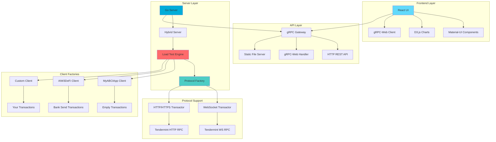
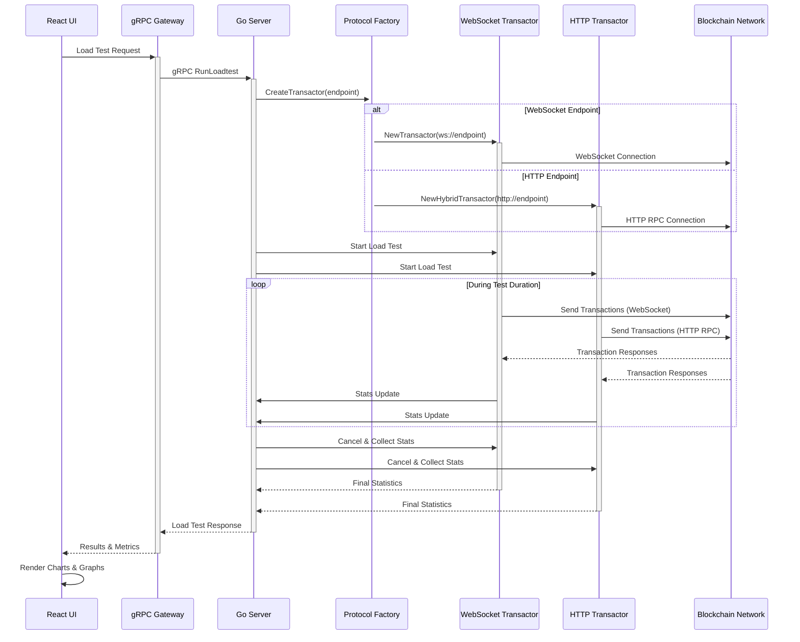
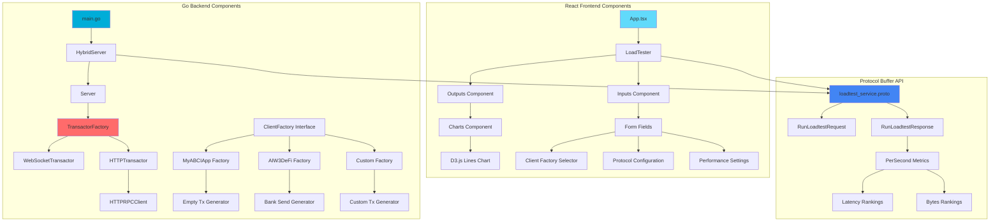
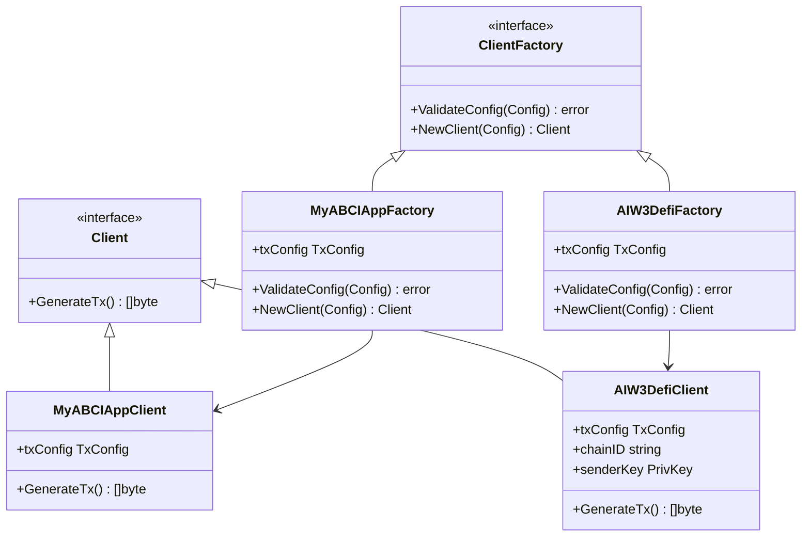
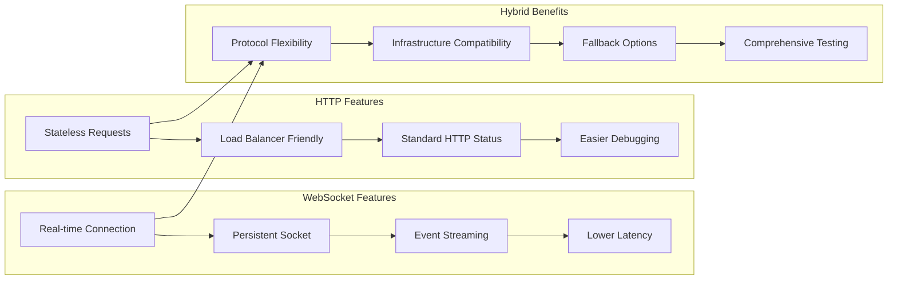
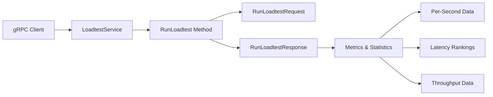
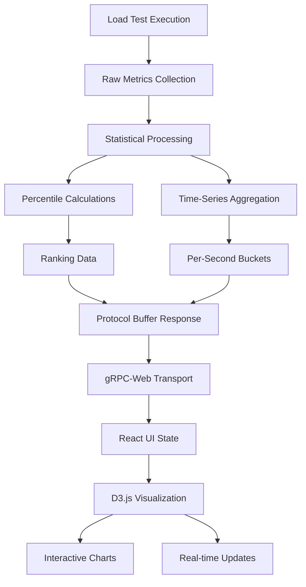

# cosmosloadtester

A comprehensive load-testing tool for Cosmos blockchain applications built on top of [informalsystems/tm-load-test](https://github.com/informalsystems/tm-load-test). It provides detailed performance metrics, latency percentile breakdowns, and real-time visualization of load test results.

## 🎯 Core Features

### 🏗️ System Architecture



### 🔄 Load Test Workflow



### 🧩 Component Architecture



## 🚀 Quick Start

### Prerequisites

- Go 1.18 or later
- Node.js 16+ and npm
- [buf](https://docs.buf.build/installation) (for protocol buffer generation)

### Building and Running

1. **Build the UI:**
   ```bash
   make ui
   ```

2. **Build the server:**
   ```bash
   make server
   ```

3. **Run the server:**
   ```bash
   ./bin/server --port=8080
   ```

4. **Access the application:**
   Open your browser to http://localhost:8080

## 🖥️ Terminal CLI Usage

### Prerequisites for CLI

- Go 1.22 or later
- Docker and Docker Compose (for containerized deployment)

### Building the CLI

```bash
# Build the CLI binary
make cli

# Or build with Docker
docker-compose build cosmosloadtester-cli
```

### CLI Quick Start

```bash
# Show help and available options
./bin/cosmosloadtester-cli --help

# List available client factories
./bin/cosmosloadtester-cli --list-factories

# Run a basic load test
./bin/cosmosloadtester-cli \
  --endpoints="ws://localhost:26657/websocket" \
  --duration=30s \
  --rate=100 \
  --client-factory="test-cosmos-client-factory"

# Interactive mode for guided setup
./bin/cosmosloadtester-cli --interactive
```

### CLI Advanced Usage Examples

#### Profile Management
```bash
# Generate a template profile
./bin/cosmosloadtester-cli --generate-template local-testnet

# Save current configuration as a profile
./bin/cosmosloadtester-cli \
  --endpoints="ws://localhost:26657/websocket,http://localhost:26657" \
  --duration=60s \
  --rate=500 \
  --connections=2 \
  --save-profile="my-testnet"

# List saved profiles
./bin/cosmosloadtester-cli --list-profiles

# Use a saved profile
./bin/cosmosloadtester-cli --profile="my-testnet"

# Show profile details
./bin/cosmosloadtester-cli --show-profile="my-testnet"
```

#### Benchmark Suites
```bash
# Quick benchmark (10s, 100 TPS)
./bin/cosmosloadtester-cli \
  --benchmark=quick \
  --endpoints="ws://localhost:26657/websocket"

# Standard benchmark (30s, sync + async tests)
./bin/cosmosloadtester-cli \
  --benchmark=standard \
  --endpoints="ws://localhost:26657/websocket"

# Stress test (60s, 5000 TPS, 10 connections)
./bin/cosmosloadtester-cli \
  --benchmark=stress \
  --endpoints="ws://localhost:26657/websocket"
```

#### Output Formats
```bash
# Live output with progress bar (default)
./bin/cosmosloadtester-cli --endpoints="..." --output-format=live

# JSON output for automation
./bin/cosmosloadtester-cli --endpoints="..." --output-format=json

# CSV output for analysis
./bin/cosmosloadtester-cli --endpoints="..." --output-format=csv

# Summary output for CI/CD
./bin/cosmosloadtester-cli --endpoints="..." --output-format=summary
```

#### Advanced Configuration
```bash
# Multi-protocol testing
./bin/cosmosloadtester-cli \
  --endpoints="ws://node1:26657/websocket,http://node2:26657,wss://node3:26657/websocket" \
  --connections=3 \
  --duration=2m \
  --rate=1000 \
  --broadcast-method=async \
  --client-factory="aiw3defi-bank-send"

# Custom transaction parameters
./bin/cosmosloadtester-cli \
  --endpoints="ws://localhost:26657/websocket" \
  --size=500 \
  --count=10000 \
  --send-period=2s \
  --stats-output="./results/loadtest-$(date +%Y%m%d-%H%M%S).csv"
```

### 🐳 Docker Deployment

#### Quick Docker Start
```bash
# Build and start the container
docker-compose up -d cosmosloadtester-cli

# Run CLI commands in container
docker-compose exec cosmosloadtester-cli cosmosloadtester-cli --help

# Example load test in container
docker-compose exec cosmosloadtester-cli cosmosloadtester-cli \
  --endpoints="ws://host.docker.internal:26657/websocket" \
  --duration=30s \
  --rate=100

# View container logs
docker-compose logs cosmosloadtester-cli

# Stop container
docker-compose down
```

#### Persistent Data and Configuration
```bash
# Profiles are saved to ./config/ on host
# Results are saved to ./results/ on host
# Examples are available in ./examples/ (read-only)

# List profiles (persisted on host)
docker-compose exec cosmosloadtester-cli cosmosloadtester-cli --list-profiles

# Generate and save a template
docker-compose exec cosmosloadtester-cli cosmosloadtester-cli \
  --generate-template=high-throughput
```

### 📊 Deployment Architecture

```mermaid
graph TB
    subgraph "Deployment Options"
        A[Local Binary] --> B[Direct Execution]
        C[Docker Container] --> D[Containerized Execution]
        E[Docker Compose] --> F[Multi-Service Stack]
    end
    
    subgraph "CLI Application"
        G[cosmosloadtester-cli] --> H[Profile Manager]
        G --> I[Load Test Engine]
        G --> J[Metrics Collector]
        G --> K[Output Formatter]
    end
    
    subgraph "Data Persistence"
        L[Host Config Dir] --> M[./config/]
        N[Host Results Dir] --> O[./results/]
        P[Container Config] --> Q[/home/cosmosload/.cosmosloadtester]
        R[Container Results] --> S[/app/results]
    end
    
    subgraph "Target Networks"
        T[Local Testnet] --> U[localhost:26657]
        V[Remote Testnet] --> W[testnet.cosmos.network:26657]
        X[Mainnet] --> Y[rpc.cosmos.network:26657]
        Z[Custom Network] --> AA[custom.rpc:26657]
    end
    
    subgraph "Monitoring & Integration"
        BB[Prometheus] --> CC[Metrics Scraping]
        DD[Grafana] --> EE[Visualization]
        FF[CI/CD Pipeline] --> GG[Automated Testing]
        HH[Alerting] --> II[Performance Monitoring]
    end
    
    A --> G
    C --> G
    E --> G
    
    G --> T
    G --> V
    G --> X
    G --> Z
    
    L --> P
    N --> R
    
    G --> BB
    CC --> DD
    G --> FF
    G --> HH
    
    style A fill:#e1f5fe
    style C fill:#e8f5e8
    style E fill:#fff3e0
    style G fill:#f3e5f5
    style BB fill:#ffebee
```

### 🔧 Integration Examples

#### CI/CD Pipeline Integration
```yaml
# GitHub Actions example
name: Load Test
on: [push, pull_request]
jobs:
  load-test:
    runs-on: ubuntu-latest
    steps:
    - uses: actions/checkout@v2
    - name: Run Load Test
      run: |
        docker-compose up -d cosmosloadtester-cli
        docker-compose exec -T cosmosloadtester-cli cosmosloadtester-cli \
          --endpoints="ws://testnet:26657/websocket" \
          --duration=30s \
          --rate=100 \
          --output-format=json > results.json
        # Parse results and set thresholds
```

#### Kubernetes Deployment
```yaml
apiVersion: batch/v1
kind: Job
metadata:
  name: cosmos-load-test
spec:
  template:
    spec:
      containers:
      - name: cosmosloadtester-cli
        image: cosmosloadtester-cli:latest
        command: ["cosmosloadtester-cli"]
        args:
        - "--endpoints=ws://cosmos-node:26657/websocket"
        - "--duration=60s"
        - "--rate=500"
        - "--output-format=json"
        volumeMounts:
        - name: results
          mountPath: /app/results
      volumes:
      - name: results
        persistentVolumeClaim:
          claimName: loadtest-results
      restartPolicy: Never
```

#### Monitoring Integration
```bash
# Export metrics to Prometheus format
./bin/cosmosloadtester-cli \
  --endpoints="ws://localhost:26657/websocket" \
  --duration=60s \
  --output-format=json | \
  jq '.avg_txs_per_second' | \
  curl -X POST http://pushgateway:9091/metrics/job/loadtest \
  --data-binary @-
```

## 🔧 Core Feature Analysis

### 🌟 **Multi-Protocol Support**
- **WebSocket**: Traditional Tendermint WebSocket RPC (ws://, wss://)
- **HTTP/HTTPS**: Modern HTTP RPC support with JSON-RPC 2.0
- **Automatic Detection**: Protocol auto-detection based on endpoint URL
- **Hybrid Execution**: Concurrent testing across multiple protocols

### 📊 **Advanced Metrics & Analytics**
- **Real-time Statistics**: Live performance metrics during test execution
- **Latency Percentiles**: P50, P75, P90, P95, P99 latency breakdown
- **Throughput Analysis**: Transactions per second with time-series data
- **Data Transfer Metrics**: Bytes sent/received tracking
- **Interactive Visualizations**: D3.js powered charts and graphs

### 🏭 **Extensible Client Factory System**


### 🎨 **Modern Web Interface**
- **Material-UI Design**: Professional, responsive interface
- **Real-time Updates**: Live progress tracking and status updates
- **Dark/Light Themes**: Customizable appearance
- **Mobile Responsive**: Works on desktop, tablet, and mobile devices
- **Form Validation**: Input validation with helpful error messages

### ⚡ **High-Performance Architecture**
- **Concurrent Execution**: Multi-threaded transaction generation
- **Connection Pooling**: Efficient connection management
- **Memory Optimized**: Minimal memory footprint for large-scale tests
- **Graceful Shutdown**: Clean resource cleanup and error handling

## 🎯 Creating Custom Client Factories

### Step 1: Create Your Client Factory

Create a new directory under `clients/` and implement the `loadtest.ClientFactory` interface. Use [clients/myabciapp/client.go](clients/myabciapp/client.go) as a template:

```go
package myclient

import (
    "github.com/cosmos/cosmos-sdk/client"
    "github.com/informalsystems/tm-load-test/pkg/loadtest"
)

type MyClientFactory struct {
    txConfig client.TxConfig
}

func NewMyClientFactory(txConfig client.TxConfig) *MyClientFactory {
    return &MyClientFactory{txConfig: txConfig}
}

func (f *MyClientFactory) ValidateConfig(cfg loadtest.Config) error {
    // Validate load test configuration
    return nil
}

func (f *MyClientFactory) NewClient(cfg loadtest.Config) (loadtest.Client, error) {
    return &MyClient{txConfig: f.txConfig}, nil
}

type MyClient struct {
    txConfig client.TxConfig
}

func (c *MyClient) GenerateTx() ([]byte, error) {
    txBuilder := c.txConfig.NewTxBuilder()
    
    // Add your custom messages here
    // Example: txBuilder.SetMsgs(myMsg)
    
    return c.txConfig.TxEncoder()(txBuilder.GetTx())
}
```

### Step 2: Register Your Factory

Add your factory to `registerClientFactories` in [cmd/server/main.go](cmd/server/main.go):

```go
func registerClientFactories() error {
    cdc := codec.NewProtoCodec(codectypes.NewInterfaceRegistry())
    txConfig := authtx.NewTxConfig(cdc, authtx.DefaultSignModes)
    
    // Register your custom client factory
    myClientFactory := myclient.NewMyClientFactory(txConfig)
    if err := loadtest.RegisterClientFactory("my-client-factory", myClientFactory); err != nil {
        return fmt.Errorf("failed to register client factory %s: %w", "my-client-factory", err)
    }
    
    return nil
}
```

### Step 3: Rebuild and Use

1. Rebuild the server: `make server`
2. Run the server: `./bin/server --port=8080`
3. In the UI, enter your factory name (`my-client-factory`) in the "Client factory" field

## 📊 Load Test Configuration

### Available Parameters

| Parameter | Description | Default | Protocol Support |
|-----------|-------------|---------|------------------|
| Client Factory | Name of the registered client factory | - | All |
| Connection Count | Number of connections per endpoint | 1 | All |
| Duration | Load test duration | 60s | All |
| Send Period | Batch send interval | 1s | All |
| Transactions/sec | Rate per connection per endpoint | 1000 | All |
| Transaction Size | Size in bytes (min 40) | 250 | All |
| Transaction Count | Max transactions (-1 = unlimited) | -1 | All |
| Broadcast Method | sync, async, or commit | sync | All |
| Endpoints | WebSocket/HTTP RPC URLs | - | Auto-detected |

### Protocol-Specific Features



### Broadcast Methods

- **sync**: Wait for CheckTx response
- **async**: Don't wait for any response  
- **commit**: Wait for transaction to be committed

## 🔌 API Usage

### gRPC

Connect directly to the gRPC service using the protocol definitions in [proto/orijtech/cosmosloadtester/v1/loadtest_service.proto](proto/orijtech/cosmosloadtester/v1/loadtest_service.proto).



### HTTP REST API

The server also exposes a REST API via gRPC-Gateway:

```bash
curl -X POST http://localhost:8080/v1/loadtest:run \
  -H "Content-Type: application/json" \
  -d '{
    "client_factory": "test-cosmos-client-factory",
    "connection_count": 1,
    "duration": "60s",
    "send_period": "1s",
    "transactions_per_second": 1000,
    "transaction_size_bytes": 250,
    "broadcast_tx_method": 1,
    "endpoints": ["ws://localhost:26657/websocket", "http://localhost:26657"]
  }'
```

## 📈 Metrics and Visualization

The tool provides comprehensive metrics including:

- **Throughput**: Transactions per second over time
- **Latency**: Response time percentiles (P50, P75, P90, P95, P99)
- **Data Transfer**: Bytes sent per second
- **Success/Error Rates**: Transaction success rates
- **Real-time Graphs**: Live visualization using D3.js

### Data Flow Architecture



## 🛠️ Development Setup

### Project Structure

```
cosmosloadtester/
├── cmd/
│   ├── server/          # Main server application
│   └── cli/             # Terminal CLI application
│       ├── main.go      # CLI main entry point
│       ├── cli.go       # CLI interface and commands
│       └── config.go    # Profile and configuration management
├── ui/                  # React frontend
├── proto/               # Protocol buffer definitions
├── server/              # Server implementation
├── pkg/                 # Go packages
│   ├── loadtest/        # Load test abstractions
│   └── httprpc/         # HTTP RPC client
├── clients/             # Client factory implementations
│   ├── myabciapp/       # Sample client factory
│   └── aiw3defi/        # AIW3 DeFi client factory
├── examples/            # CLI usage examples
│   └── cli-examples.sh  # Demonstration scripts
├── config/              # Configuration profiles (mounted volume)
├── results/             # Test results output (mounted volume)
├── monitoring/          # Monitoring configuration
│   ├── prometheus.yml   # Prometheus configuration
│   └── grafana/         # Grafana dashboards
├── Dockerfile           # Multi-stage Docker build
├── docker-compose.yml   # Container orchestration
├── docker-entrypoint.sh # Container entry script
├── .dockerignore        # Docker build exclusions
├── CLI_README.md        # CLI-specific documentation
├── DOCKER_README.md     # Docker deployment guide
└── build/               # Build artifacts
```

### Available Make Commands

- `make pb` - Generate protocol buffer code
- `make ui` - Build the React frontend
- `make server` - Build the Go server binary
- `make cli` - Build the CLI binary
- `make docker-build` - Build Docker image
- `make docker-run` - Run Docker container
- `make docker-init` - Initialize Docker directories

### Protocol Buffer Generation

The project uses [buf](https://docs.buf.build/) for protocol buffer code generation:

```bash
cd proto
buf mod update
buf generate --template buf.gen.yaml
buf generate --template buf.gen.ts.grpcweb.yaml --include-imports
```

### Frontend Development

```bash
cd ui
npm install
npm start  # Runs on port 3000 with hot reload
```

### Backend Development

```bash
# Install dependencies
go mod download

# Run with live reload (requires air)
air

# Or run directly
go run cmd/server/main.go --port=8080
```

### Testing

```bash
# Run Go tests
go test ./...

# Run frontend tests  
cd ui && npm test
```

## 🐛 Troubleshooting

### Common Issues

#### Web UI Issues
1. **Port already in use**: Change the port with `--port=8081`
2. **UI not loading**: Ensure `make ui` was run successfully
3. **gRPC connection errors**: Check that endpoints are accessible

#### CLI Issues
4. **CLI binary not found**: Run `make cli` to build the binary
5. **Permission denied**: Make the binary executable with `chmod +x bin/cosmosloadtester-cli`
6. **Profile not found**: Check profile exists with `--list-profiles`
7. **Endpoint unreachable**: Use `--check-endpoints` to verify connectivity
8. **Invalid configuration**: Use `--validate-config` to check settings

#### Docker Issues
9. **Container won't start**: Check Docker daemon is running
10. **Network conflicts**: Use `docker network prune` to clean up networks
11. **Volume mount issues**: Ensure `./config` and `./results` directories exist
12. **Build failures**: Check Go version compatibility (requires Go 1.22+)

#### General Issues
13. **Client factory not found**: Verify registration in `registerClientFactories`
14. **Protocol detection issues**: Ensure endpoints have proper URL schemes
15. **Memory issues**: Reduce connection count or transaction rate for large tests

### Debug Logging

#### Server Debug Logging
```bash
./bin/server --port=8080 --log-level=debug
```

#### CLI Debug Logging
```bash
./bin/cosmosloadtester-cli --log-level=debug --endpoints="..." --duration=30s
```

#### Docker Debug Logging
```bash
# View container logs
docker-compose logs -f cosmosloadtester-cli

# Run with debug output
docker-compose exec cosmosloadtester-cli cosmosloadtester-cli \
  --log-level=debug \
  --endpoints="ws://host.docker.internal:26657/websocket" \
  --duration=30s
```

### Network Connectivity

#### Test Endpoint Connectivity
```bash
# WebSocket endpoint
curl -H "Upgrade: websocket" -H "Connection: Upgrade" ws://localhost:26657/websocket

# HTTP endpoint  
curl -X POST http://localhost:26657 -H "Content-Type: application/json" \
  -d '{"jsonrpc":"2.0","method":"status","params":{},"id":1}'

# Using CLI endpoint checker
./bin/cosmosloadtester-cli --check-endpoints --endpoints="ws://localhost:26657/websocket"
```

#### Docker Network Issues
```bash
# Check Docker networks
docker network ls

# Test connectivity from container
docker-compose exec cosmosloadtester-cli ping host.docker.internal

# Check if endpoints are accessible from container
docker-compose exec cosmosloadtester-cli cosmosloadtester-cli \
  --check-endpoints \
  --endpoints="ws://host.docker.internal:26657/websocket"
```

### Performance Tuning

#### Optimize for High Throughput
```bash
# Increase connections and use async broadcasting
./bin/cosmosloadtester-cli \
  --endpoints="ws://localhost:26657/websocket" \
  --connections=10 \
  --rate=5000 \
  --broadcast-method=async \
  --send-period=500ms
```

#### Optimize for Low Latency
```bash
# Use fewer connections and sync broadcasting
./bin/cosmosloadtester-cli \
  --endpoints="ws://localhost:26657/websocket" \
  --connections=1 \
  --rate=100 \
  --broadcast-method=sync \
  --size=40
```

### Configuration Validation

```bash
# Validate configuration before running
./bin/cosmosloadtester-cli \
  --endpoints="ws://localhost:26657/websocket" \
  --duration=60s \
  --rate=1000 \
  --validate-config

# Dry run to see what would be executed
./bin/cosmosloadtester-cli \
  --endpoints="ws://localhost:26657/websocket" \
  --duration=60s \
  --rate=1000 \
  --dry-run
```

## 📄 License

This project is licensed under the terms specified in [LICENSE](LICENSE).

## 🤝 Contributing

1. Fork the repository
2. Create a feature branch
3. Make your changes
4. Add tests for new functionality
5. Submit a pull request

## 📚 Related Projects

- [tm-load-test](https://github.com/informalsystems/tm-load-test) - Core load testing framework
- [Cosmos SDK](https://github.com/cosmos/cosmos-sdk) - Blockchain application framework
- [Tendermint](https://github.com/tendermint/tendermint) - Byzantine fault-tolerant consensus engine

## 📖 Additional Documentation

- [CLI_README.md](CLI_README.md) - Comprehensive CLI usage guide
- [DOCKER_README.md](DOCKER_README.md) - Docker deployment documentation
- [examples/cli-examples.sh](examples/cli-examples.sh) - CLI usage examples and demonstrations

## 🌐 AIW3 Devnet Integration

### Quick Start with AIW3 Devnet

The cosmosloadtester includes built-in support for AIW3 devnet with specialized client factories for DeFi operations:

```bash
# Quick AIW3 devnet test
./bin/cosmosloadtester-cli \
  --endpoints="https://devnet-rpc.aiw3.io" \
  --client-factory="aiw3defi-bank-send" \
  --duration=30s \
  --rate=100 \
  --connections=2

# Use the automated setup script
./examples/aiw3-devnet-example.sh
```

### AIW3 Network Information

| Service | URL | Description |
|---------|-----|-------------|
| **RPC Endpoint** | `https://devnet-rpc.aiw3.io` | Main RPC endpoint for transactions |
| **Faucet Server** | `https://devnet-faucet.aiw3.io` | Get test tokens for development |

### Getting Test Tokens

To get test tokens for AIW3 devnet, use the faucet service:

```bash
# Request test tokens (replace with your test address)
curl -X POST https://devnet-faucet.aiw3.io/request \
  -H 'Content-Type: application/json' \
  -d '{"address": "aiw3...", "amount": "1000000"}'
```

### AIW3-Specific Client Factories

- **`aiw3defi-bank-send`**: Specialized for AIW3 DeFi bank send transactions
- **`test-cosmos-client-factory`**: Generic Cosmos transactions (also works with AIW3)

### AIW3 Load Testing Examples

```bash
# High-throughput DeFi testing
./bin/cosmosloadtester-cli \
  --endpoints="https://devnet-rpc.aiw3.io" \
  --client-factory="aiw3defi-bank-send" \
  --duration=60s \
  --rate=1000 \
  --connections=5 \
  --broadcast-method=async

# Latency measurement
./bin/cosmosloadtester-cli \
  --endpoints="https://devnet-rpc.aiw3.io" \
  --client-factory="aiw3defi-bank-send" \
  --duration=30s \
  --rate=10 \
  --connections=1 \
  --broadcast-method=commit

# Create and use AIW3 profile
./bin/cosmosloadtester-cli --generate-template=aiw3defi-test
./bin/cosmosloadtester-cli --profile=aiw3defi-test
```

### Docker with AIW3 Devnet

```bash
# Run AIW3 devnet test in Docker
docker-compose exec cosmosloadtester-cli cosmosloadtester-cli \
  --endpoints="https://devnet-rpc.aiw3.io" \
  --client-factory="aiw3defi-bank-send" \
  --duration=30s \
  --rate=100

# Use the automated setup script in Docker
docker-compose exec cosmosloadtester-cli /app/examples/aiw3-devnet-example.sh
```

---

*Built with ❤️ for the Cosmos ecosystem*
