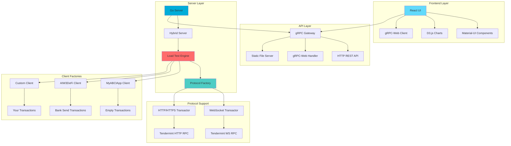
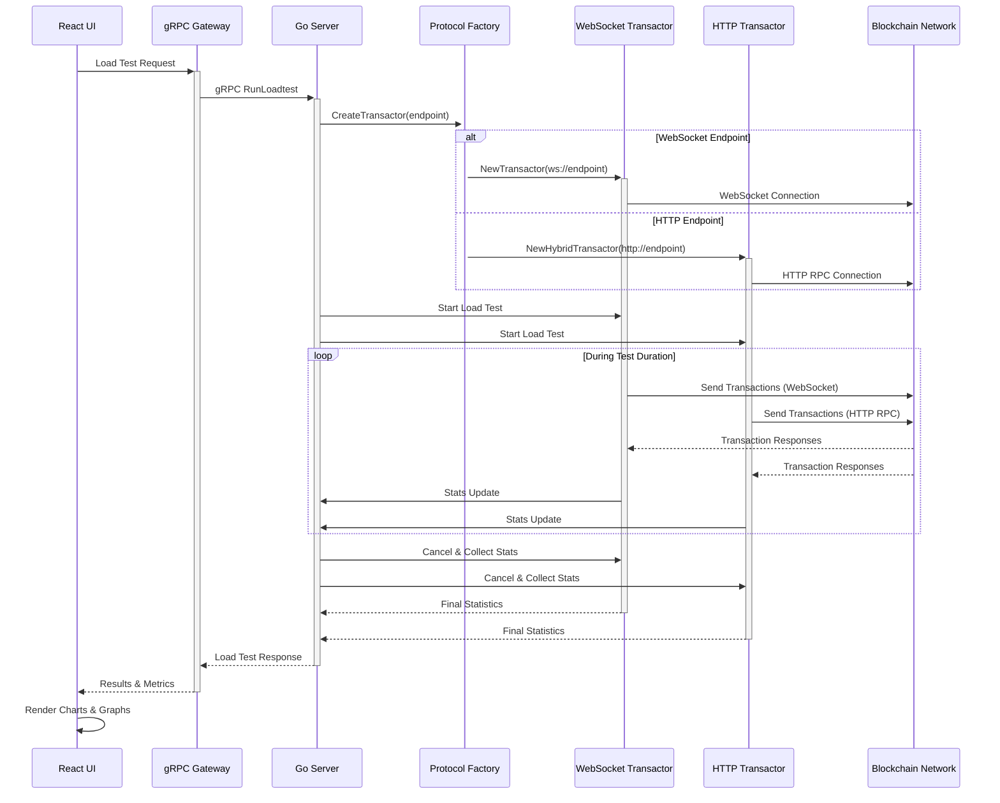
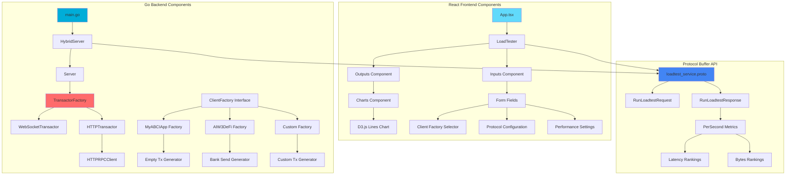
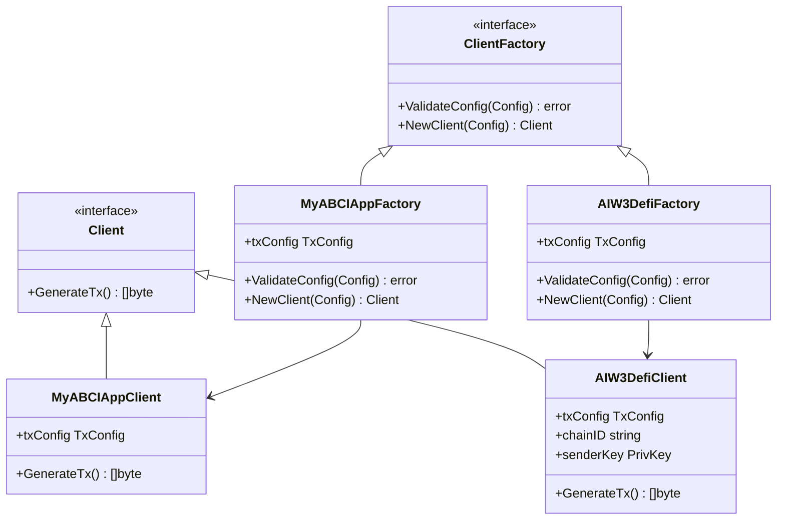
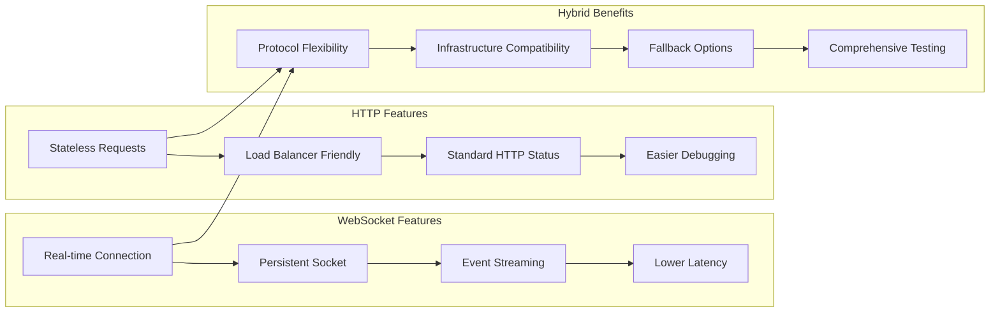
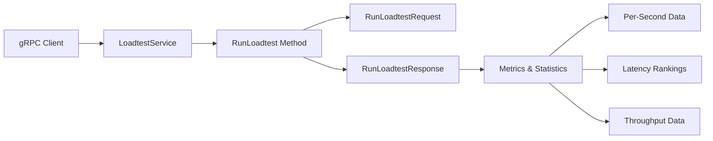
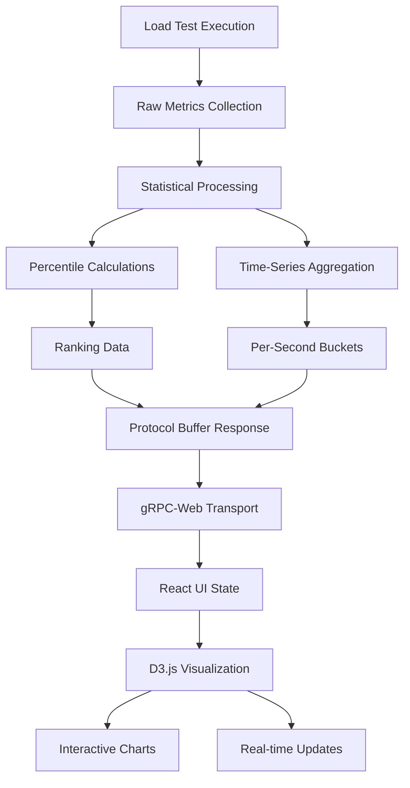

# cosmosloadtester

A comprehensive load-testing tool for Cosmos blockchain applications built on top of [informalsystems/tm-load-test](https://github.com/informalsystems/tm-load-test). It provides detailed performance metrics, latency percentile breakdowns, and real-time visualization of load test results.

## 🎯 Core Features

### 🏗️ System Architecture



### 🔄 Load Test Workflow



### 🧩 Component Architecture



## 🚀 Quick Start

### Prerequisites

- Go 1.18 or later
- Node.js 16+ and npm
- [buf](https://docs.buf.build/installation) (for protocol buffer generation)

### Building and Running

1. **Build the UI:**
   ```bash
   make ui
   ```

2. **Build the server:**
   ```bash
   make server
   ```

3. **Run the server:**
   ```bash
   ./bin/server --port=8080
   ```

4. **Access the application:**
   Open your browser to http://localhost:8080

## 🔧 Core Feature Analysis

### 🌟 **Multi-Protocol Support**
- **WebSocket**: Traditional Tendermint WebSocket RPC (ws://, wss://)
- **HTTP/HTTPS**: Modern HTTP RPC support with JSON-RPC 2.0
- **Automatic Detection**: Protocol auto-detection based on endpoint URL
- **Hybrid Execution**: Concurrent testing across multiple protocols

### 📊 **Advanced Metrics & Analytics**
- **Real-time Statistics**: Live performance metrics during test execution
- **Latency Percentiles**: P50, P75, P90, P95, P99 latency breakdown
- **Throughput Analysis**: Transactions per second with time-series data
- **Data Transfer Metrics**: Bytes sent/received tracking
- **Interactive Visualizations**: D3.js powered charts and graphs

### 🏭 **Extensible Client Factory System**


### 🎨 **Modern Web Interface**
- **Material-UI Design**: Professional, responsive interface
- **Real-time Updates**: Live progress tracking and status updates
- **Dark/Light Themes**: Customizable appearance
- **Mobile Responsive**: Works on desktop, tablet, and mobile devices
- **Form Validation**: Input validation with helpful error messages

### ⚡ **High-Performance Architecture**
- **Concurrent Execution**: Multi-threaded transaction generation
- **Connection Pooling**: Efficient connection management
- **Memory Optimized**: Minimal memory footprint for large-scale tests
- **Graceful Shutdown**: Clean resource cleanup and error handling

## 🎯 Creating Custom Client Factories

### Step 1: Create Your Client Factory

Create a new directory under `clients/` and implement the `loadtest.ClientFactory` interface. Use [clients/myabciapp/client.go](clients/myabciapp/client.go) as a template:

```go
package myclient

import (
    "github.com/cosmos/cosmos-sdk/client"
    "github.com/informalsystems/tm-load-test/pkg/loadtest"
)

type MyClientFactory struct {
    txConfig client.TxConfig
}

func NewMyClientFactory(txConfig client.TxConfig) *MyClientFactory {
    return &MyClientFactory{txConfig: txConfig}
}

func (f *MyClientFactory) ValidateConfig(cfg loadtest.Config) error {
    // Validate load test configuration
    return nil
}

func (f *MyClientFactory) NewClient(cfg loadtest.Config) (loadtest.Client, error) {
    return &MyClient{txConfig: f.txConfig}, nil
}

type MyClient struct {
    txConfig client.TxConfig
}

func (c *MyClient) GenerateTx() ([]byte, error) {
    txBuilder := c.txConfig.NewTxBuilder()
    
    // Add your custom messages here
    // Example: txBuilder.SetMsgs(myMsg)
    
    return c.txConfig.TxEncoder()(txBuilder.GetTx())
}
```

### Step 2: Register Your Factory

Add your factory to `registerClientFactories` in [cmd/server/main.go](cmd/server/main.go):

```go
func registerClientFactories() error {
    cdc := codec.NewProtoCodec(codectypes.NewInterfaceRegistry())
    txConfig := authtx.NewTxConfig(cdc, authtx.DefaultSignModes)
    
    // Register your custom client factory
    myClientFactory := myclient.NewMyClientFactory(txConfig)
    if err := loadtest.RegisterClientFactory("my-client-factory", myClientFactory); err != nil {
        return fmt.Errorf("failed to register client factory %s: %w", "my-client-factory", err)
    }
    
    return nil
}
```

### Step 3: Rebuild and Use

1. Rebuild the server: `make server`
2. Run the server: `./bin/server --port=8080`
3. In the UI, enter your factory name (`my-client-factory`) in the "Client factory" field

## 📊 Load Test Configuration

### Available Parameters

| Parameter | Description | Default | Protocol Support |
|-----------|-------------|---------|------------------|
| Client Factory | Name of the registered client factory | - | All |
| Connection Count | Number of connections per endpoint | 1 | All |
| Duration | Load test duration | 60s | All |
| Send Period | Batch send interval | 1s | All |
| Transactions/sec | Rate per connection per endpoint | 1000 | All |
| Transaction Size | Size in bytes (min 40) | 250 | All |
| Transaction Count | Max transactions (-1 = unlimited) | -1 | All |
| Broadcast Method | sync, async, or commit | sync | All |
| Endpoints | WebSocket/HTTP RPC URLs | - | Auto-detected |

### Protocol-Specific Features



### Broadcast Methods

- **sync**: Wait for CheckTx response
- **async**: Don't wait for any response  
- **commit**: Wait for transaction to be committed

## 🔌 API Usage

### gRPC

Connect directly to the gRPC service using the protocol definitions in [proto/orijtech/cosmosloadtester/v1/loadtest_service.proto](proto/orijtech/cosmosloadtester/v1/loadtest_service.proto).



### HTTP REST API

The server also exposes a REST API via gRPC-Gateway:

```bash
curl -X POST http://localhost:8080/v1/loadtest:run \
  -H "Content-Type: application/json" \
  -d '{
    "client_factory": "test-cosmos-client-factory",
    "connection_count": 1,
    "duration": "60s",
    "send_period": "1s",
    "transactions_per_second": 1000,
    "transaction_size_bytes": 250,
    "broadcast_tx_method": 1,
    "endpoints": ["ws://localhost:26657/websocket", "http://localhost:26657"]
  }'
```

## 📈 Metrics and Visualization

The tool provides comprehensive metrics including:

- **Throughput**: Transactions per second over time
- **Latency**: Response time percentiles (P50, P75, P90, P95, P99)
- **Data Transfer**: Bytes sent per second
- **Success/Error Rates**: Transaction success rates
- **Real-time Graphs**: Live visualization using D3.js

### Data Flow Architecture



## 🛠️ Development Setup

### Project Structure

```
cosmosloadtester/
├── cmd/server/          # Main server application
├── ui/                  # React frontend
├── proto/               # Protocol buffer definitions
├── server/              # Server implementation
├── pkg/                 # Go packages
│   ├── loadtest/        # Load test abstractions
│   └── httprpc/         # HTTP RPC client
├── clients/             # Client factory implementations
│   ├── myabciapp/       # Sample client factory
│   └── aiw3defi/        # AIW3 DeFi client factory
└── build/               # Build artifacts
```

### Available Make Commands

- `make pb` - Generate protocol buffer code
- `make ui` - Build the React frontend
- `make server` - Build the Go server binary

### Protocol Buffer Generation

The project uses [buf](https://docs.buf.build/) for protocol buffer code generation:

```bash
cd proto
buf mod update
buf generate --template buf.gen.yaml
buf generate --template buf.gen.ts.grpcweb.yaml --include-imports
```

### Frontend Development

```bash
cd ui
npm install
npm start  # Runs on port 3000 with hot reload
```

### Backend Development

```bash
# Install dependencies
go mod download

# Run with live reload (requires air)
air

# Or run directly
go run cmd/server/main.go --port=8080
```

### Testing

```bash
# Run Go tests
go test ./...

# Run frontend tests  
cd ui && npm test
```

## 🐛 Troubleshooting

### Common Issues

1. **Port already in use**: Change the port with `--port=8081`
2. **UI not loading**: Ensure `make ui` was run successfully
3. **gRPC connection errors**: Check that endpoints are accessible
4. **Client factory not found**: Verify registration in `registerClientFactories`
5. **Protocol detection issues**: Ensure endpoints have proper URL schemes

### Debug Logging

Set log level for more detailed output:

```bash
./bin/server --port=8080 --log-level=debug
```

### Network Connectivity

Test endpoint connectivity:

```bash
# WebSocket endpoint
curl -H "Upgrade: websocket" -H "Connection: Upgrade" ws://localhost:26657/websocket

# HTTP endpoint  
curl -X POST http://localhost:26657 -H "Content-Type: application/json" \
  -d '{"jsonrpc":"2.0","method":"status","params":{},"id":1}'
```

## 📄 License

This project is licensed under the terms specified in [LICENSE](LICENSE).

## 🤝 Contributing

1. Fork the repository
2. Create a feature branch
3. Make your changes
4. Add tests for new functionality
5. Submit a pull request

## 📚 Related Projects

- [tm-load-test](https://github.com/informalsystems/tm-load-test) - Core load testing framework
- [Cosmos SDK](https://github.com/cosmos/cosmos-sdk) - Blockchain application framework
- [Tendermint](https://github.com/tendermint/tendermint) - Byzantine fault-tolerant consensus engine

---

*Built with ❤️ for the Cosmos ecosystem*
